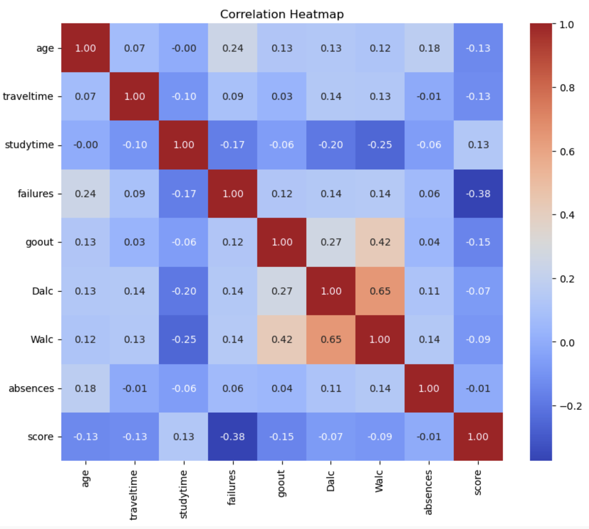
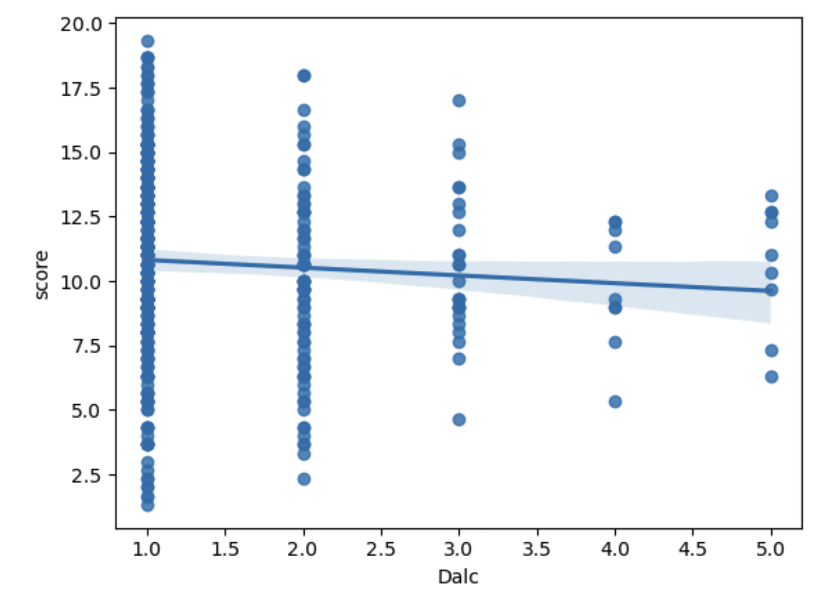
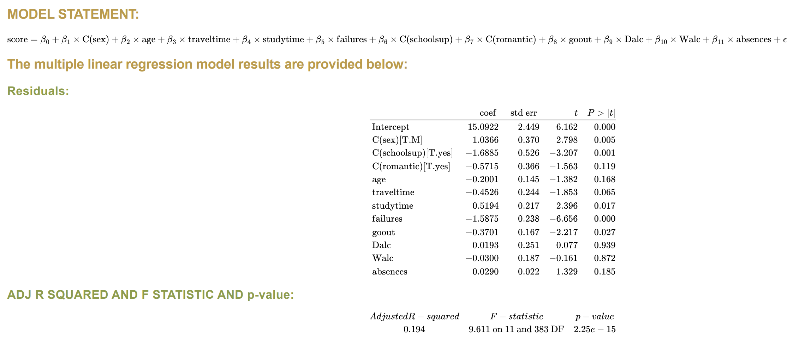
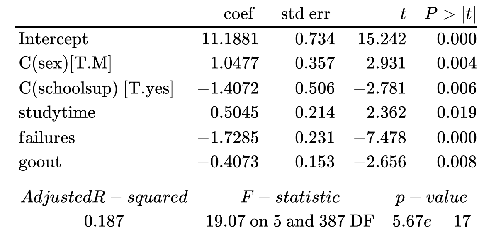

# Linear-Regression-project

## About

This dataset, curated by P. Cortez and A. Silva (UCI Machine Learning), provides a comprehensive view into the academic and social dynamics of secondary school students. It was collected to investigate student performance in mathematics and Portuguese language courses. The dataset encompasses a wide array of information, ranging from students' demographics to family background and study routines.

## Project Description
In this project, we use Python to identify influential factors, including alcohol consumption, that significantly impact students' final grades. Our objective is to construct a predictive linear regression model that reveals the intricate relationship between final grades and these significant predictors.

## Data Exploratory

**1. Data Source:** The dataset has been sourced from Kaggle and was collected via a survey of students.

**2. Dataset Characteristics:**

- The dataset consists 395 observations, each contributing information on 30 distinct variables.
- Demographics: School, Gender (Female or Male), Age (15 to 22 years), Address, Family Size, Parental Cohabitation Status (Living together or Apart)
- Time: Travel Time, Free Time After School, Going Out with Friends, Weekly Study Time
- Family factor: Mother's Education, Father's Education, Mother's Job, Father's Job, Family Relationship Quality, Family Educational Support
- School factor: School Support, Extra Paid Classes, Extra-curricular Activities, Nursery Attendance, Desire for Higher Education, School Absences, Test Failures in the past
- Alcohol assumption during weekday and weekend
- Others: Health Status, Romantic Relationship
- Academic Performance: Final Grades (G1, G2, G3, ranging from 0 to 20)
 
**3. Structure of the Analysis:**
- Initial Exploratory Analysis: Gaining initial insights about the dataset.
- Initial t-test: Conducting initial hypothesis testing.
- Regression Analysis on Significant Variables: Based on EDA and t-test results.
- Model Selection
- Model Diagnosis: Validating assumptions, identifying influential points, checking for heteroscedasticity, and assessing multicollinearity
- Final Model Selection
- Summary: Presenting findings and results, with a focus on significant features, assumption checks, and how the model results address the original research question. Additionally, addressing potential issues with the data and results

**4. Libraries Used:** Numpy, Pandas, Matplotlib, Seaborn, Statsmodels

## Results and Visualizations

  

The heatmap heightened social outings correspond to increased weekend alcohol consumption, displaying a strong positive correlation with weekday consumption. Failures exhibit a significant negative correlation with final grades, while parental education levels show a similar negative correlation with failures. Moreover, higher parental education positively influences final grades. Most other variables exhibit weak or negligible correlations.

   

The regplot indicates a relatively flat relationship between scores and daily alcohol consumption (Dalc), suggesting no strong linear correlation between the two variables.

---
We then conducted initial t-tests to assess each factor's significance in relation to others. Combined with EDA and domain knowledge, we retained key following variables: sex, age, travel time, study time, failures, school support, romantic relationships, social outings, alcohol consumption, and absences.

  

### Model selection:

After a thorough model diagnosis, we identified heteroscedasticity and influential data points in the initial model incorporating 11 predictors. To rectify these issues, we addressed outlier data points, performed t-tests, and conducted ANOVA analyses. Based on significance levels, the final model retained five predictors: sex, school support, study time, failures, and going out.

  

## Outcomes:

This project investigates the impact of factors, including alcohol consumption, on student math performance using a multifaceted linear regression model. Key findings:

- Alcohol Consumption: No significant evidence suggests a strong influence on performance.
- Significant Predictors: Gender, travel time, study time, educational support, and outside activities affect performance. Notably, male students scored higher, longer study times and fewer failures lead to better scores, while more outings correlate with lower performance.
- Model Diagnostic: Residuals deviate from normality, indicating potential heteroscedasticity. No autocorrelation or major multicollinearity issues were found. An outlier in 'absences' requires further investigation.
- Limitations: Data is limited to two schools, potentially limiting generalizability. Self-reported data may introduce biases. Focus on math and portuguese performance may not reflect overall academic capabilities.

**In summary, while alcohol consumption may not be a primary influencer, variables like study time, failures, and educational support strongly impact academic performance. Future research can refine analysis and explore additional factors.**

## Files and Directories:
- README.md: Contains the project description.
- images/: Directory containing all images and visualization files.
- LR_Gradefactors_code.ipynb: Jupyter Notebook with project code.
- LR_Gradefactors_docs: Document summarizing project findings.

## Authors:
- Alex Yang
- Freeman Chen 
- Yen Phan

## Source:
- https://www.kaggle.com/datasets/uciml/student-alcohol-consumption?select=student-mat.csv

 
